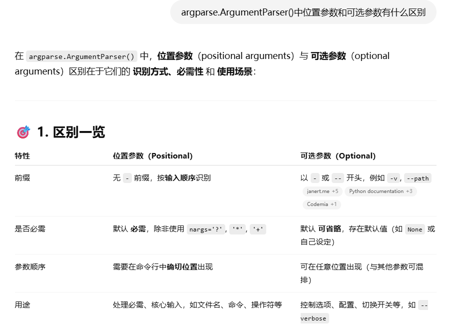
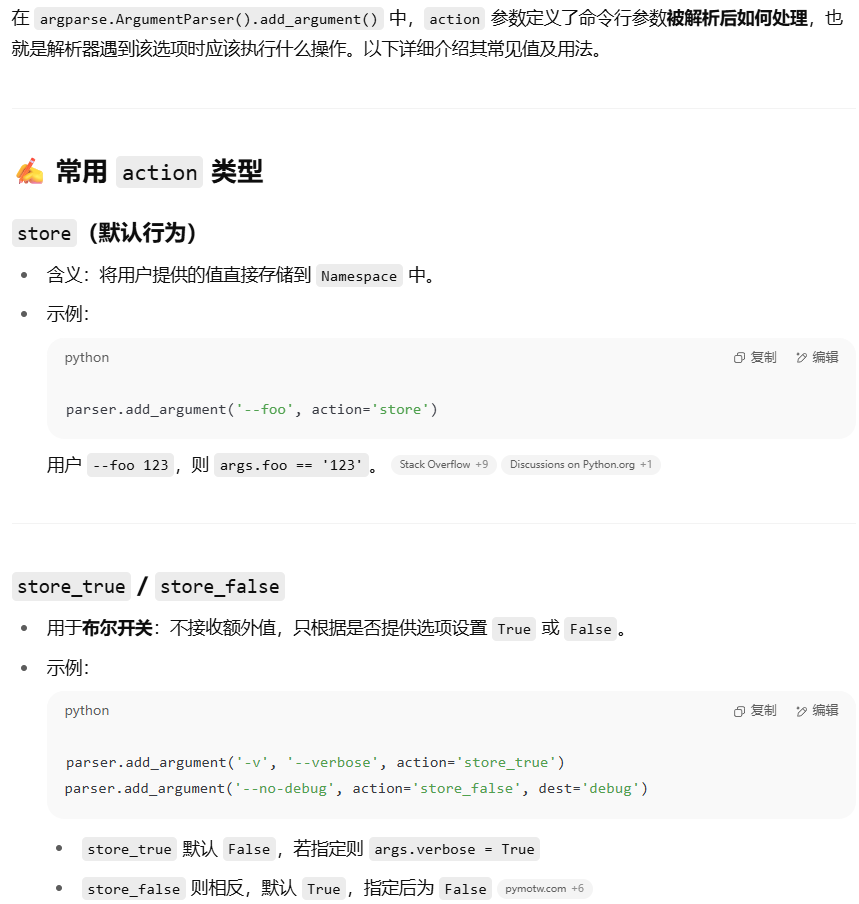
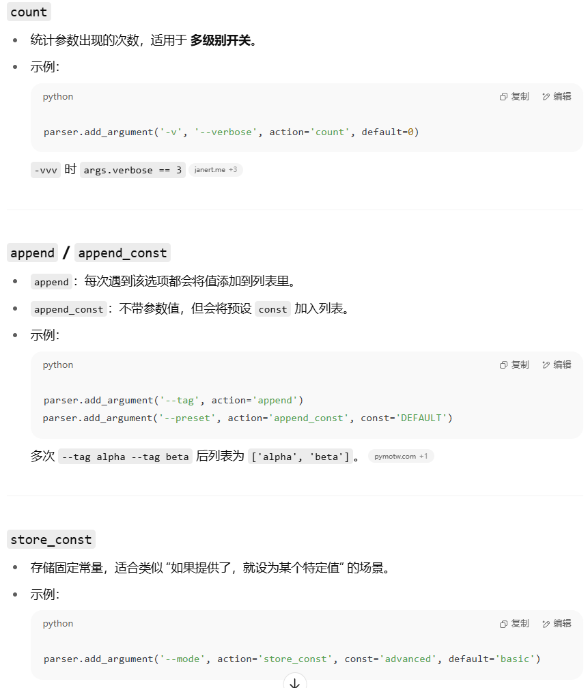
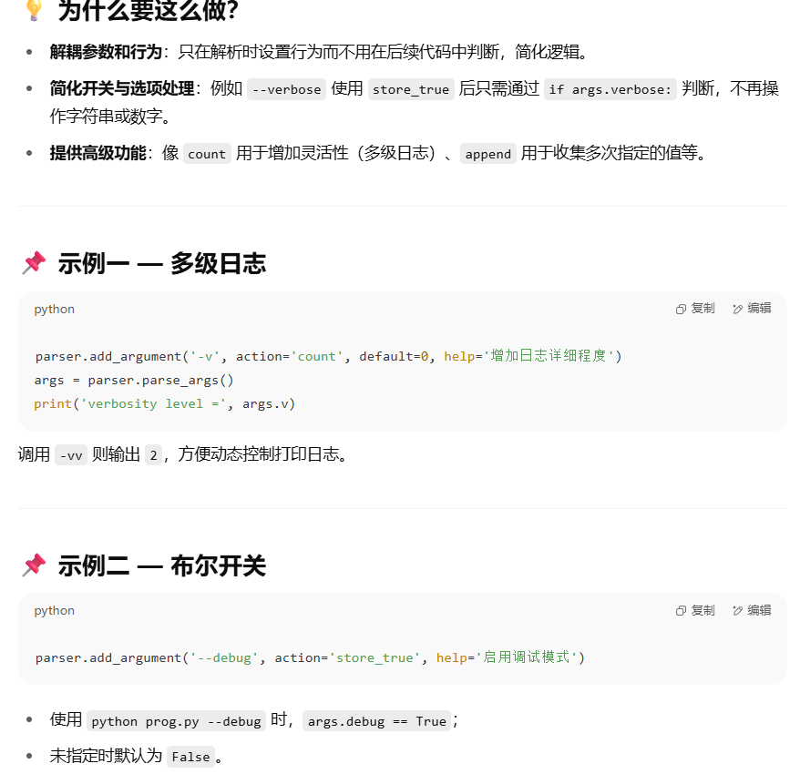
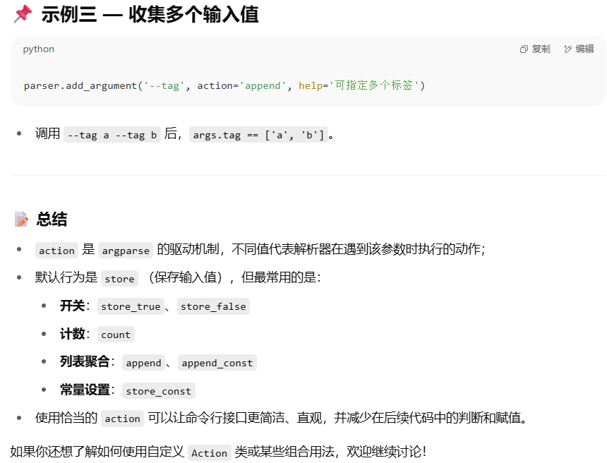

# Argparse Tutorial

https://youtu.be/aGy7U5ItLRk

https://docs.python.org/3/library/argparse.html?utm_source=chatgpt.com

```Python
from argparse import ArgumentParser, Namespace

parser = ArgumentParser() #创建实例化解析器

parser.add_argument('echo', help='Echos the given string')
parser.add_argument('square', help='Squares a given number', type=int)

args:Namespace = parser.parse_args() #解析命令行输入
    
print(args.echo)
print(args.square ** 2)


'''
# 命令行操作
python main.py hello
'''

## END END

from argparse import ArgumentParser, Namespace

parser = ArgumentParser() #创建实例化解析器

parser.add_argument('square', help='Squares a given number', type=int)
parser.add_argument('-v', '--verbose', help='Provides a verbose desc', action='store_true')#提供位置参数 #如果加入required=True 则命令行中必须提供定义

args:Namespace = parser.parse_args() #解析命令行输入
    
if args.verbose:
    print(f'{args.square} squared is: {args.square ** 2}')
else:
    print(args.square ** 2)


'''
# 命令行操作
python main.py 10
out : 100

python main.py 10 -v
out : 10 squared is: 100

python main.py -v 10  ##参数位置不重要
out : 10 squared is: 100

python main.py 10 --verbose
out : 10 squared is: 100
'''

## END END

from argparse import ArgumentParser, Namespace

parser = ArgumentParser() #创建实例化解析器

parser.add_argument('square', help='Squares a given number', type=int)
parser.add_argument('-v', '--verbose', help='Provides a verbose desc', type=int, choices=[0,1,2])#提供位置参数 #如果加入required=True 则命令行中必须提供定义

args:Namespace = parser.parse_args() #解析命令行输入
    
if args.verbose == 0:
    print('Option 1')
elif args.verbose == 1:
    print('Option 2')
elif args.verbose == 2:
    print('Option 3')
    
print(args.square ** 2)

'''
# 命令行操作
python main.py 2 -v
out : 系统报错 expected one argument

pythob main.py 2 -v 0
out : Option 1
		4

pythob main.py 2 -v 4
out : invalid choice : 4
'''

## END END


from argparse import ArgumentParser, Namespace

parser = ArgumentParser() #创建实例化解析器

parser.add_argument('square', help='Squares a given number', type=int, default=0, nargs='?')
parser.add_argument('-v', '--verbose', help='verbose descroption. Use -vv for extra verbose', action='count')#提供可选参数 #如果加入required=True 则命令行中必须提供定义

args:Namespace = parser.parse_args() #解析命令行输入

result: int = args.square ** 2
if args.verbose == 1:
    print(f'The result is :{result}')
elif args.verbose == 2:
    print(f'{args.square} ** {args.square} = {result}')
else:
    print(result)
'''
# 命令行操作
python main.py
out : 0

pythob main.py 2 -v 
out : The result is: 4

python main.py 2 -vv
out : 2 **2 = 4

python main.py 2 -vvvv
out : 4

python main.py 2 --verbose --verbose
out : 2 **2 = 4
'''

## END END

from argparse import ArgumentParser, Namespace

parser = ArgumentParser() #创建实例化解析器
group = parser.add_mutually_exclusive_group()
parser.usage = "Use it like this"

parser.add_argument('a', help='The base value', type=int)
parser.add_argument('b', help='The exponent', type=int)
group.add_argument('-v', '--verbose', help='Provides a verbose descroption. Use -vv for extra verbose', action='count')
group.add_argument('-s', '--silence', help='Generate a silent version of the output', action='store_true') #group 告诉程序使得在给定时刻只运行其中一个选项

args: Namespace = parser.parse_args()
result:int = args.a ** args.b

if 	args.silence:
    print('Silenced!')
else:
    match args.verbose:
        case 1:
            print(f'The result is {result}')
        case 2:
            print(f'{args.a0} ** {args.b} == {result}')
        case _:
            print(result)
```










