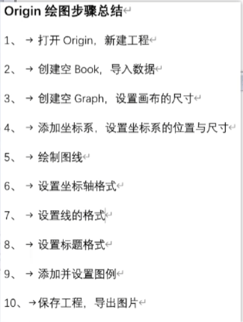

# 前言

 # Python

[Numpy](https://numpy.org.cn/)

# 深度学习
[scikit_learn](https://scikit-learn.org/stable/modules/preprocessing.html#standardization-or-mean-removal-and-variance-scaling)

## Pytorch
[Pytorch官网手册](https://pytorch.org/docs/stable/index.html)
[李宏毅2021 Spring](https://speech.ee.ntu.edu.tw/~hylee/ml/2021-spring.php)
[Enzo 课件](https://enzo-miman.github.io/#/README)
[水论文程序猿](https://www.cnblogs.com/nickchen121/p/15105048.html)
[位置编码与注意力机制](https://blog.csdn.net/qq_33746593/article/details/107202590)

[《动手学深度学习》 — 动手学深度学习 2.0.0 documentation (d2l.ai)](https://zh-v2.d2l.ai/)

[跟李沐学AI的个人空间-跟李沐学AI个人主页-哔哩哔哩视频 (bilibili.com)](https://space.bilibili.com/1567748478)

[pytorch必须掌握的4种边界Padding方法 - 知乎 (zhihu.com)](https://zhuanlan.zhihu.com/p/95368411)

### Transformer
[T one](https://kazemnejad.com/blog/transformer_architecture_positional_encoding/#proposed-method)
[T 2](https://nlp.seas.harvard.edu/2018/04/03/attention.html#model-architecture)
[T 3](https://zhuanlan.zhihu.com/p/403433120)

[一文教你彻底理解Transformer中Positional Encoding - 知乎 (zhihu.com)](https://zhuanlan.zhihu.com/p/338592312#怎么样去做positional Encoding？)

### 强化学习

[xccds/Ten_Minute_RL (github.com)](https://github.com/xccds/Ten_Minute_RL)

# 网站博客搭建

[Hexo搭建](https://zhuanlan.zhihu.com/p/547520780?utm_id=0)

[Hexo 多机](https://blog.csdn.net/K1052176873/article/details/122879462)

Windows命令行进入对应文件路径：

**C:\WINDOWS\system32>D:**

***D:\>cd BBlog***

`hexo clean` 删除 public 文件夹，即删除旧的博客文章

`hexo g` 生成 public 文件夹，即生成新的博客文章相关 html 文件

`hexo d` 将博客推送到 github

补充：后续写文章、修改配置后的保存推送操作

至此，网站部署至master分支，整个网站备份至hexo分支。当网站的配置或文章修改后都要将远程仓库更新。首先，依次执行
'''git add .``git commit -m ChangeFiles（更新信息内容可改)``git push （或者git push origin hexo)'''
保证hexo分支版本最新。然后执行
'''hexo d -g'''

# 控制

[(45 封私信 / 80 条消息) 想学习自适应控制、滑模控制、模糊控制、鲁棒控制，如何打下基石，该看些什么书？ - 知乎 (zhihu.com)](https://www.zhihu.com/question/25347270)

# 机器人

[(33 封私信 / 32 条消息) 学习机器人运动学，动力学需要哪些数学基础课程？ - 知乎 (zhihu.com)](https://www.zhihu.com/question/61879863/answer/3336818984)

## 海洋机器人

## 资料网站

([Z-Library – 世界上最大的电子图书馆。自由访问知识和文化。](https://zh.z-library.se/))

([Tbox导航 | 只收录优质在线工具的导航网站 (tboxn.com)](https://www.tboxn.com/#term-80))

[Zotero 插件商店 - Zotero 中文社区 (zotero-chinese.github.io)](https://zotero-chinese.github.io/zotero-plugins/#/)

[Emoji大全 | Emoji表情符号词典 📓 | EmojiAll中文官方网站](https://www.emojiall.com/zh-hans)

# 期刊会议

[盘点一下，人工智能顶刊顶会有哪些？ - 知乎 (zhihu.com)](https://zhuanlan.zhihu.com/p/585191008)

## 人工智能会议

[部分计算机会议和期刊论文的下载方法_acm论文下载-CSDN博客](https://blog.csdn.net/zffustb/article/details/114916952)

[AAAI Conference Proceedings - AAAI](https://aaai.org/aaai-publications/aaai-conference-proceedings/)

## 科研网页

[Publication Database (fossen.biz)](https://www.fossen.biz/publications/)

# 科研工具

## Origin

【Origin科研绘图超快速上手指南】https://www.bilibili.com/video/BV1BA411i7PT?vd_source=2ec9cc7a2d133f3a19434aaf945dabd6

[(46 封私信 / 80 条消息) 为什么我的origin图标绘制不显示book数据 ？ - 知乎 (zhihu.com)](https://www.zhihu.com/question/525797309)

[Origin学会粘贴格式，告别重复排版！-王飞的博客嘿嘿 (upcwangfei.com)](https://www.upcwangfei.com/original-article/2021/04/20/1162/#:~:text=Origin学会粘贴格式，告别重复排版！ 1 01、在调整好格式的图上方鼠标右键选择[复制格式]-[所有格样式式]。 2 02、在需要调整格式的图上方鼠标右键点击（注意，鼠标左键不要点击）选择[粘贴格式]。 3 03、这样，瞬间就设置好了图的格式，非常快速！ 动图演示,求关注！ 小号防丢 关注一波 公众号的自动回复快到上限了 为了能够发布资源 关注下备用号嘿~~ 原文始发于微信公众号（大飞鸽软件助手）： Origin学会粘贴格式，告别重复排版！)

## Latex

[【LaTeX应用】常用数学公式和符号 - 知乎 (zhihu.com)](https://zhuanlan.zhihu.com/p/464237097)

# 计算机基础

[U盘启动盘还原的方法_u盘设置u盘启动怎么还原-CSDN博客](https://blog.csdn.net/weixin_45305215/article/details/126067988#:~:text=U盘启动盘还原的方法 1 1、先将u盘插入到电脑，然后在电脑上按下win%2Br快捷键打开运行菜单，输入"cmd"回车确定打开命令提示符页面。 2 2、 然后在命令提示符输入"diskpart"回车确定。 3 3、,后面输几，比如这里是1。 6 6、选择磁盘1，也就是u盘后，在DISKPART>右侧继续输入命令"clean"回车确认，这样就会清除u盘信息。 7 7、然后可以在磁盘管理界面看见u盘变成了一个未分配的磁盘了。 8 8、鼠标右键单击未分配的磁盘空间，选择新建简单卷。 更多项目)